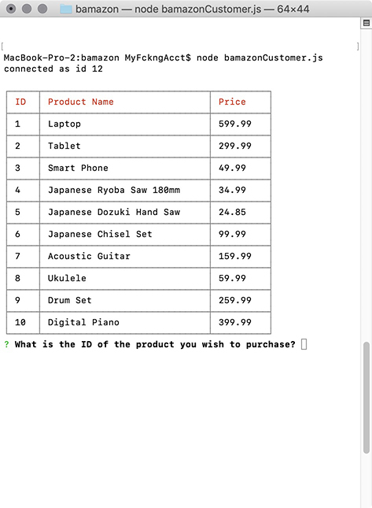
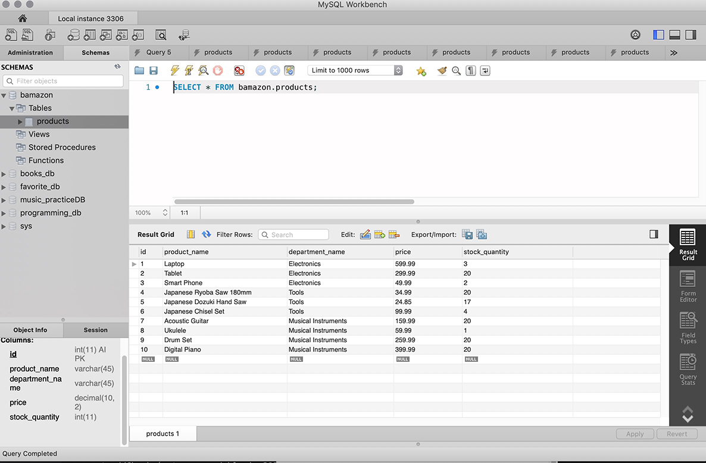

# BAMAZON: Sell Your Items and Track Your Inventory

An Amazon-like storefront. This app will take in orders from customers and deplete stock from the store's inventory. Track inventory, track sales.

### Getting Started

Navigate to the folder you want to install this program. After cloning the repository, cd into the bamazon folder that clone created before running npm install. See step by step below.

### Installation

- clone this repository
- cd into the bamazon folder
- npm install (installs all the dependencies listed below.)
- command are run in the terminal screen

Bamazon is a nodeJS program so there are dependencies required. Along with NodeJS (npm install node), you will need to run npm install for the following NPM programs:

* [mySQL] (https://www.npmjs.com/package/mysql)
* [Inquirer] (https://www.npmjs.com/package/inquirer)

### Built With

* [NodeJS](https://nodejs.org/en/) - Node.js is an open-source, cross-platform JavaScript run-time environment that executes JavaScript code outside of a browser.
* [mySQL](https://www.npmjs.com/package/mysql) - Open source database
* [Inquirer](https://www.npmjs.com/package/inquirer) - A collection of common interactive command line user interfaces. 

### Screen Captures

Database for the Bamazon Store

Shows the customer what is avaiable for purchase

Allows customer to buy items

Screenshot showing the updates to the database to reflect purchase

Menu of Manager options

Shows the inventory items that have less than 5 items.

Shows database with updated new item.

### License

This project is licensed under the MIT License - see the [LICENSE.md](LICENSE.md) file for details
